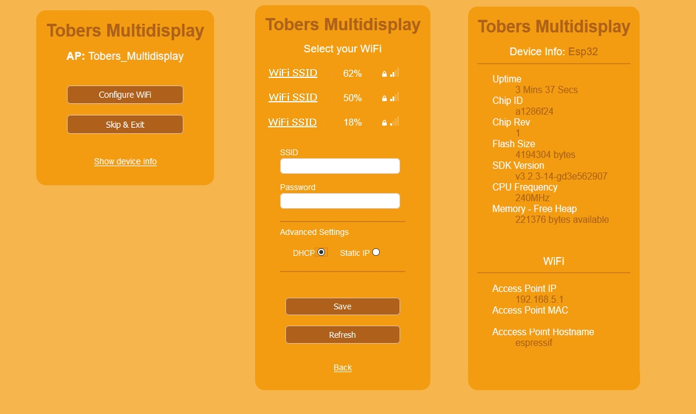
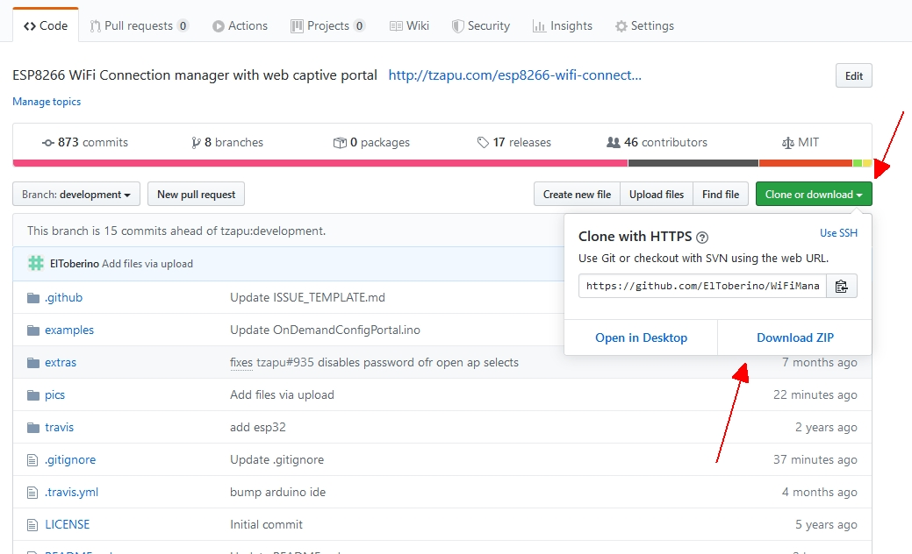

# WiFiManager for Multidisplay
This is a fork of the development branch of tzapu's [WiFiManager](https://github.com/tzapu/WiFiManager/tree/development) customized for [Tobers Multidisplay](https://github.com/ElToberino/Tobers_Multidisplay). It works with ESP8266 and ESP32. 
 
Most changes I made are visual ones: some new/other css rules and some changes in shown menu items.
Beside that I moved the css and javascript definitions into the filesystem on Flash Memory - they had become too large and made the portal unstable. I also added a new public function getStaticMode() returning if the connection has been made with a static IP address.
All changes are marked with the comment ///CHANGE MULTISDISPLAY 
 
As mentioned above, this fork was especially made for my program [Tobers Multidisplay](https://github.com/ElToberino/Tobers_Multidisplay). This program uses WifiManager only for the first connection with a WiFi or if WiFi credentials have been erased by user. On normal startup it is not required to call WifiManager because ESPs store WiFi credentials persistently in flash memory. For interesting information on how ESPs set up their WiFi connection take a short look at [this discussion](https://forum.arduino.cc/index.php?topic=652513) in the Arduino Forum. 
 
If you want to try this fork of WiFiManager for your own program, remember that you have to save the files "WMstyle.css" and "WMscript.js" on SPIFFS. 
  
**Added features**
- loading css and js files from SPIFFS
- added function *wifiManager.getStaticMode()* delivers *true* if WiFi-connection has been made with a static IP address
- added function *wifiManager.getTimeoutState()* delivers *true* if ConfigPortalTimeout has occured
- added function *useLittleFS* enables LittleFS instead of SPIFFS (-> Esp8266 ONLY!) 
 

    

 
 

**Download and Installation**

Just click on "Clone or Download" -> "Download ZIP" to download the library.
Unpack the library into your Arduino libraries folder. 

    
 
**Important Note** if you also have the original WiFiManager installed in your library: You can't have both WiFiManagers in your library folder at the same time - this will cause a compiling error. So move the WiFiManager version you don't use at the moment into another folder before compiling. 
  

Successfully compiled with Arduino 1.8.12, 1.8.13 / ESP8266 core for Arduino 2.6.3, 2.7.4 / Arduino core for the ESP32 1.0.5. 
For further information take a look at the original project [WiFiManager](https://github.com/tzapu/WiFiManager/tree/development) .
 
 
 
<b>Thanks a lot</b> to tzapu, tablatronix and all the other contributors for their great work.

