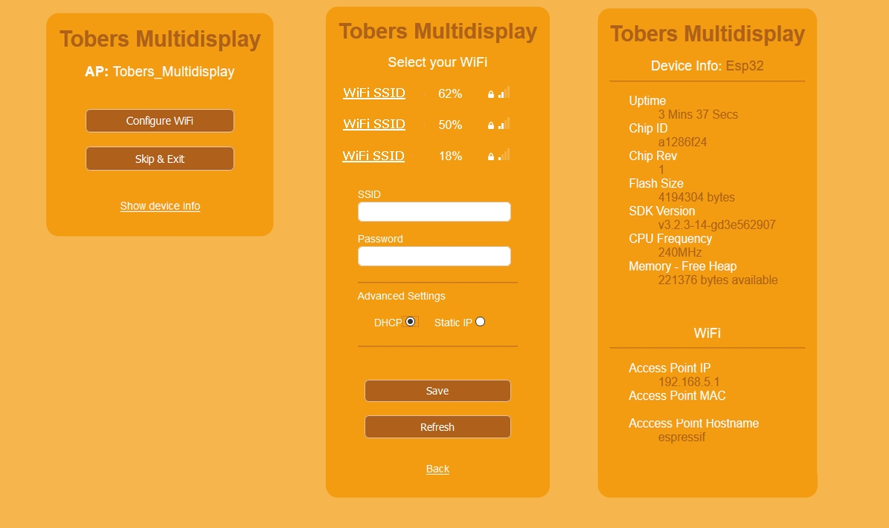
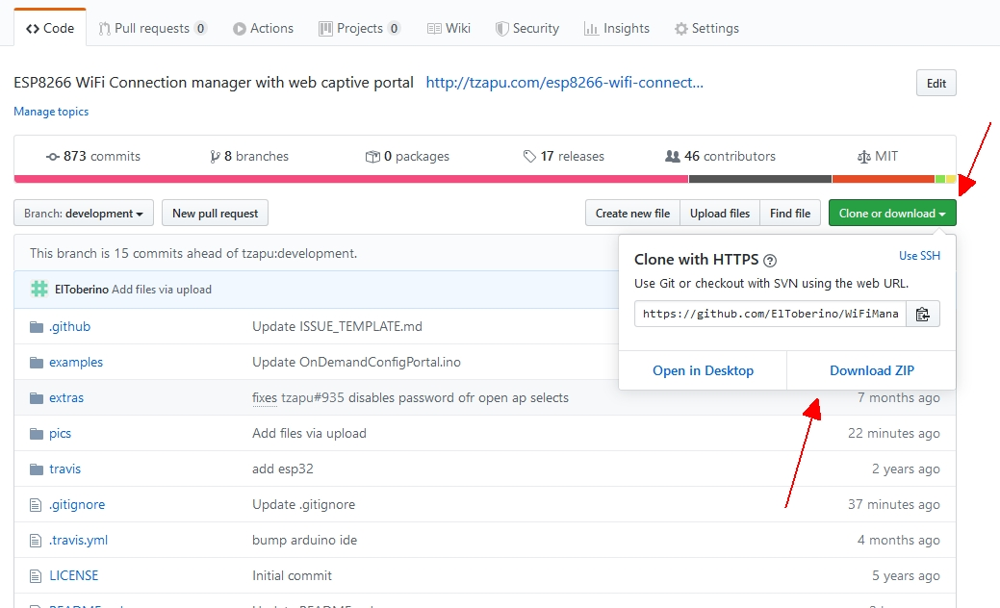

# NOT YET FINISHED !!!
# WiFiManager for Multidisplay
This is a custom fork of the development branch of tzapu's [WiFiManager](https://github.com/tzapu/WiFiManager/tree/development) especially created for [Tobers Multidisplay](https://github.com/ElToberino/Tobers_Multidisplay). It works with ESP8266 and ESP32.

The changes I made are mainly visual ones: some new/other css rules and some changes in shown menu items:

    

 
 

**Download and Installation**

Just click on "Clone or Download" -> "Download ZIP" to downlaod the library.
Unpack the library into your Arduino libraries folder.

    
 
 

Successfully compiled with Arduino 1.8.12, ESP8266 core for Arduino 2.6.3 / Arduino core for the ESP32 1.0.4. 
For further information visit the original project [WiFiManager](https://github.com/tzapu/WiFiManager/tree/development) .
 
 
<b>Thanks a lot</b> to tzapu, tablatronix and all the other contributors for their great work.

